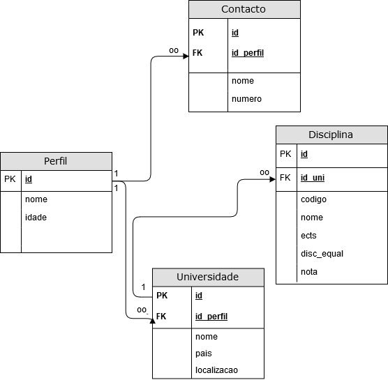

# ErasmusInfo
Trabalho para a aula de Programação Avançada.

A app possibilita ao utilizador, registrar informação sobre país e a universidade, e o que pretende fazer em Erasmus.

Funcionalidades:
 
  - Registo de disciplinas a fazer na universidade.
  - Registo da nota final das disciplinas feitas na universidade.
  - Registo de informações do país importante. 
    - Contactos: Polícia, Hospital, etc
 
 Tabelas:
 
  - Perfil
    - Nome
    - Idade
  - Universidade
    - Nome
    - País
    - Localização
  - Contactos
    - Nome
    - Número
  - Disciplinas
    - Codigo
    - Nome
    - ECTs
    - Disciplina Equivalente
    - Nota
   
 Relações:
  
   - Perfil 1..M Contactos
   - Perfil 1..1 Universidade
   - Universidade 1..M Disciplinas
  
    
  
